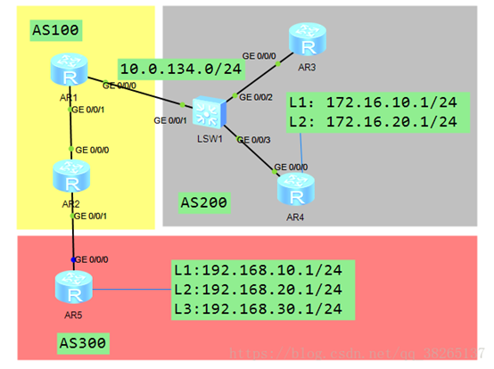
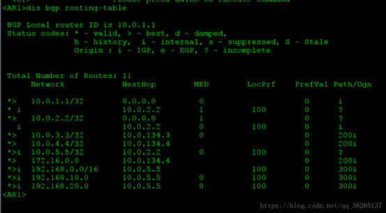
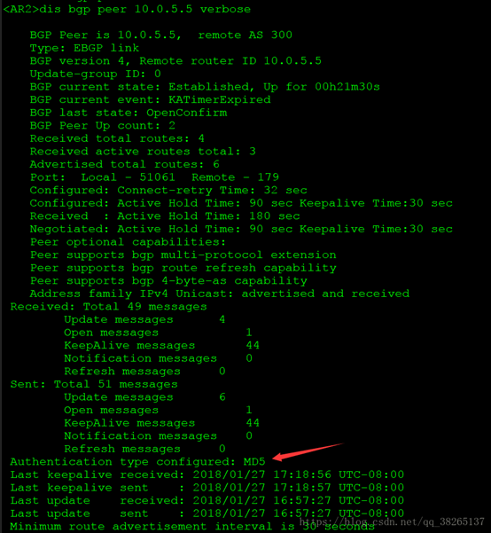
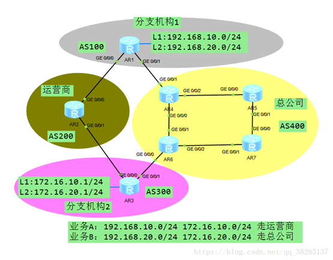
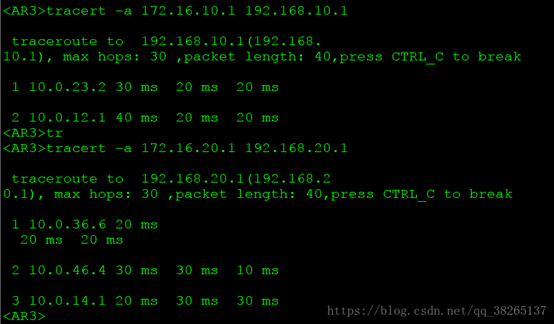
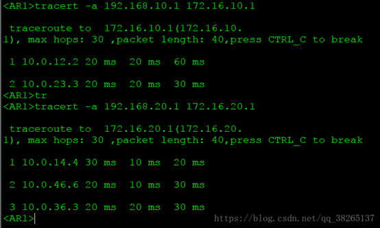
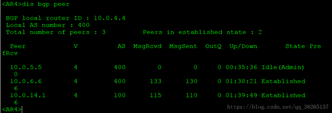
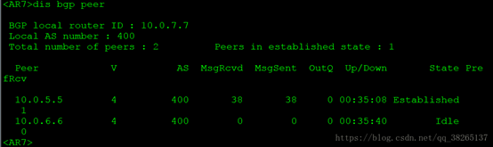
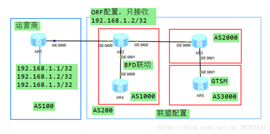
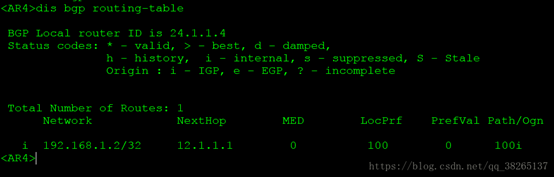

# BGP命令行配置

## 2020.07.10

## BGP命令行简介

### 配置BGP的基本功能：

#### 启动BGP进程：

`bgp 100//启动bgp指定as号`

`router-id 1.1.1.1`

`//配置BGP的router-id`

### 配置BGP对等体：

配置BGP对等体时，如果指定对等体所属的AS编号与本地AS编号相同，表示配置IBGP对等体。如果指定对等体所属的AS编号与本地AS编号不同，表示配置EBGP对等体。为了增强BGP连接的稳定性，推荐使用路由可达的Loopback接口地址建立BGP连接。

注：当使用Loopback接口的IP地址建立BGP连接时，两端需同时配置peer connect-interface ，保证端TCP连接的接口和地址的正确性。如果仅有一端配置该命令，可能导致BGP连接建立失败。

当使用Loopback接口的IP地址建立EBGP连接时，必须配置命令peer ebgp-max-hop，否则EBGP连接将无法建立。

若需要对大量对等体进行相同的配置，可以通过配置BGP对等体组来减轻配置工作量。

`[BGP] peer 12.1.1.1 as-number 100`

`//创建BGP对等体`

`peer 12.1.1.1 connet-interface lookback 0`

`//指定发送BGP报文的源接口，并可指定发起连接时使用的源地址。`

`//缺省情况下，BGP使用报文的出接口作为BGP报文的源接口。`

`peer 12.1.1.1 ebgp-max-hop 2`

`//指定建立EBGP连接允许的最大跳数。` 

`//缺省情况下，EBGP连接允许的最大跳数为1，即只能在物理直连链路上建立EBGP连接。`

### 配置BGP对等体组：

`group 1 [ external | internal ]`

`//创建对等体组。`

`peer 1 as-number 100`

`//配置EBGP对等体组的AS号。` 

`peer 12.1.1.2 group 1`

`//向对等体组中加入对等体。`

### 配置BGP引入路由：

BGP协议本身不发现路由，因此需要将其他路由（如IGP路由等）引入到BGP路由表中，从而将这些路由在AS之内和AS之间传播。BGP协议支持通过以下两种方式引入路由：

* Import方式：按协议类型，将RIP路由、OSPF路由、ISIS路由等协议的路由引入到BGP路由表中。为了保证引入的IGP路由的有效性，Import方式还可以引入静态路由和直连路由。

* Network方式：逐条将IP路由表中已经存在的路由引入到BGP路由表中，比Import方式更精确。

`import-router protocol` 

`//引入路由`

`default-route imported`

`//允许BGP引入本地IP路由表中已经存在的缺省路由。` 

`network 1.1.1.1 mask 32` 

`//配置BGP逐条引入IPv4路由表或IPv6路由表中的路由。`

## 配置BGP安全性：

### 配置MD5认证：

BGP使用TCP作为传输协议，只要TCP数据包的源地址、目的地址、源端口、目的端口和TCP序号是正确的，BGP就会认为这个数据包有效，但数据包的大部分参数对于攻击者来说是不难获得的。为了保证BGP协议免受攻击，可以在BGP邻居之间使用MD5认证或者Keychain认证来降低被攻击的可能性。其中MD5算法配置简单，配置后生成单一密码，需要人为干预才可以更换密码。

`peer 12.1.1.2 password cipher Huawei` 

`//配置MD5认证密码`

### 配置Keychain认证：

Keychain具有一组密码，可以根据配置自动切换，但是配置过程较为复杂，适用于对安全性能要求比较高的网络。

`peer 12.1.1.2 keychain 1`

`//配置Keychain认证`

BGP对等体两端必须都配置针对使用TCP连接的应用程序的Keychain认证，且配置的Keychain必须使用相同的加密算法和密码，才能正常建立TCP连接，交互BGP消息。Keychain认证推荐使用SHA256和HMAC-SHA256加密算法。

BGP MD5认证与BGP Keychain认证互斥。

### 配置BGP GTSM功能：

为防止攻击者模拟真实的BGP协议报文对设备进行攻击，可以配置GTSM功能检测IP报文头中的TTL值。根据实际组网的需要，对于不符合TTL值范围的报文，GTSM可以设置为通过或丢弃。当配置GTSM缺省动作为丢弃时，可以根据网络拓扑选择合适的TTL有效范围，不符合TTL值范围的报文会被接口板直接丢弃，这样就避免了网络攻击者模拟的“合法”BGP报文攻击设备。

`peer 12.1.1.2 valid-ttl-hops 254`

`//配置BGP GTSM功能。` 

`//缺省情况下，BGP对等体（组）上未配置GTSM功能。`

 `gtsm default-action { drop | pass}`

`//设置未匹配GTSM策略的报文的缺省动作。` 

`//缺省情况下，未匹配GTSM策略的报文可以通过过滤。`

## 简化IBGP网络连接：

### 配置BGP路由反射器：

在AS内部，为保证IBGP对等体之间的连通性，需要在IBGP对等体之间建立全连接关系。当IBGP对等体数目很多时，建立全连接网络的开销很大。使用路由反射器RR（Route Reflector）可以解决这个问题。 

集群ID用于防止集群内多个路由反射器和集群间的路由环路。当一个集群里有多个路由反射器时，必须为同一个集群内的所有路由反射器配置相同的集群ID。

如果路由反射器的客户机之间重新建立了IBGP全连接关系，那么客户机之间的路由反射就是没有必要的，而且还占用带宽资源。此时可以配置禁止客户机之间的路由反射，减轻网络负担。

在一个AS内，RR主要有路由传递和流量转发两个作用。当RR连接了很多客户机和非客户机时，同时进行路由传递和流量转发会使CPU资源消耗很大，影响路由传递的效率。如果需要保证路由传递的效率，可以在该RR上禁止BGP将优选的路由下发到IP路由表，使RR主要用来传递路由。

`peer { group-name | ipv4-address | ipv6-address } reflect-client`

`//配置路由反射器及其客户。` 

`refelctor cluster-id 1.1.1.1`

`//配置路由反射器的集群ID。` 

`undo reflect between-clients`

`//禁止客户机之间的路由反射。`

`routing-table rib-noly [ route-policy route-policy-name ]`

`//禁止BGP将优选的路由下发到IP路由表。`

## 配置BGP联盟：

联盟将一个自治系统划分为若干个子自治系统，每个子自治系统内部的IBGP对等体建立全连接关系或者配置反射器，子自治系统之间建立EBGP连接关系。大型BGP网络中，配置联盟不但可以减少IBGP连接的数量，还可以简化路由策略的管理，提高路由的发布效率。

`confederation id { as-number-plain | as-number-dot }`

`//配置联盟ID`

`confederation peer-as { as-number-plain | as-number-dot } &<1-32>`

`//指定属于同一个联盟的子AS号。` 

`confederation nonstandard`

`//配置联盟的兼容性。`

注：同一联盟内不能同时配置2字节AS号的Old Speaker和4字节AS号的New Speaker。因为AS4_Path不支持联盟，这种配置可能会引起环路。

## 配置BGP路由选路和负载分担：

### 配置BGP协议优先级：

由于路由器上可能同时运行多个动态路由协议，就存在各个路由协议之间路由信息共享和选择的问题。系统为每一种路由协议设置一个缺省优先级。在不同协议发现同一条路由时，优先级高的路由将被优选。

`preference 255`

`//设定BGP的协议优先级。`

`//缺省情况下，BGP的协议优先级为255。`

`//配置优先级的值越小，优先级越高。`

BGP有三种路由：

* 从外部对等体学到的路由（EBGP）

* 从内部对等体学到的路由（IBGP）

* 本地产生的路由（Local Origined）,是指通过聚合命令所聚合的路由。

可以为这三种路由设定不同的优先级。

另外，还可以通过应用路由策略，为符合匹配条件的特定路由配置优先级。对于不符合匹配条件的路由，则使用缺省优先级。

若同时配置了external internal local和route-policy route-policy-name，则通过策略的路由按路由策略中的规则设置，未通过策略的路由优先级按external internal local设置。

### 配置Next_Hop属性：

当ASBR将从EBGP邻居学到的路由转发给IBGP邻居时，默认不修改下一跳。IBGP邻居收到该路由后，会发现下一跳不可达，于是将该路由设为非活跃路由，不通过该路由指导流量转发。当希望IBGP邻居通过该路由指导流量转发时，可以在ASBR上配置向IBGP对等体（组）转发路由时，将自身地址作为下一跳。这时，IBGP邻居收到ASBR从EBGP邻居学习来的路由后，发现下一跳可达，于是将路由设为活跃路由。

当BGP路由发生变化时，BGP需要对非直连的下一跳重新进行迭代。如果不对迭代后的路由进行任何限制，则BGP可能会将下一跳迭代到一个错误的转发路径上，从而造成流量丢失。此时，可配置BGP按路由策略迭代下一跳，避免流量丢失。

`peer 12.1.1.1 next-hop-local` 

`//配置BGP设备向IBGP对等体（组）发布路由时，把下一跳地址设为自身的IP地址。`

`//缺省情况下，BGP设备向IBGP对等体发布路由时，不修改下一跳地址。`

`nexthop recursive-loolup router-policy` 

`//配置BGP按路由策略进行下一跳迭代。`

`peer 12.1.1.1 next-hop-invariable`

`//配置发布引入的IGP路由时不改变该IGP路由的下一跳地址。` 

`//缺省情况下，对等体在发布所引入的IGP路由时会将下一跳`

`//地址改为本地与对端连接的接口地址。` 

### 配置BGP路由信息的首选值：

协议首选值（PrefVal）是华为设备的特有属性，该属性仅在本地有效。当BGP路由表中存在到相同目的地址的路由时，将优先选择协议首选值高的路由。

`peer 12.1.1.1 perferred-value value`

`//为从指定对等体学来的所有路由配置首选值。` 

`//缺省情况下，从对等体学来的路由的初始首选值为0。`

### 配置本地缺省Local_Pref属性：

Local_Pref属性用于判断流量离开AS时的最佳路由。当BGP的设备通过不同的IBGP对等体得到到AS外的目的地址相同但下一跳不同的多条路由时，将优先选择Local_Pref属性值较高的路由。

`defaut local-preference 100`

`//配置本机的缺省Local_Pref属性值。` 

`//缺省情况下，BGP本地优先级的值为100。`

### 配置AS_Path属性：

AS_Path属性按矢量顺序记录了某条路由从本地到目的地址所要经过的所有AS编号。配置不同的AS_Path属性功能，可以实现灵活的路由选路。

* 通常情况下，AS_Path属性内AS_Path数量作为BGP选路条件。当不需要AS_Path属性作为选路条件时，可以配置不将AS_Path属性作为选路条件。

* 通常情况下，BGP通过AS号检测路由环路。但在Hub and Spoke组网方式下，为保证路由能够正确传递，从Hub-CE发布私网路由到Spoke-CE途中经过的相关BGP对等体需要配置允许AS_Path中AS号重复1次的路由通过。

* 公有AS号可以直接在Internet上使用，私有AS号直接发布到Internet上可能造成环路现象。为了解决上述情况，可以在把路由发布到Internet前，配置发送EBGP更新报文时，AS_Path属性中仅携带公有AS编号。

* 在重构AS_Path或聚合生成新路由时，可以对AS_Path中的AS号最大个数予以限制。配置AS_Path属性中AS号的最大个数后，接收路由时会检查AS_Path属性中的AS号是否超限，如果超限则丢弃路由。

* 通常情况下，一个设备只支持一个BGP进程，即只支持一个AS号。但是在某些特殊情况下，例如网络迁移更换AS号的时候来为了保证网络切换的顺利进行，可以为指定对等体设置一个伪AS号。

* BGP会检查EBGP对等体发来的更新消息中AS_Path列表的第一个AS号，确认第一个AS号必须是该EBGP对等体所在的AS。否则，该更新信息被拒绝，EBGP连接中断。如果不需要BGP检查EBGP对等体发来的更新消息中AS_Path列表的第一个AS号，可以关闭此功能。

`route-policy AS-path permit node 10`

 `apply as-path 100 { additive | overwrite }`

`//设置BGP路由的AS_Path属性。`

`peer 12.1.1.1 route-policy AS-path export`

`//对向对等体（组）发布的路由添加AS_Path属性。`

`import-route protocol route-policy AS-path`

`//BGP以import方式引入的路由添加AS_Path属性。`

`network 12.1.1.1 route-policy AS-path`

`//对BGP以network方式引入的路由添加AS_Path属性。`

`` 

`bestrouter as-path-ignore`

`//不将AS_Path属性作为选路条件。`

`peer 12.1.1.1 allow-as-loop 100`

`//允许本地AS编号重复出现。`

`//缺省情况下，不允许本地AS号重复。` 

`peer 12.1.1.1 public-as-only`

`//配置发送EBGP更新报文时，AS_Path属性中仅携带公有AS编号。`

`//缺省情况下，发送EBGP更新报文时，AS_Path属性中可以同时携带公有AS号和私有AS号。` 

`as-path-limit 255`

`//配置AS_Path属性中AS号的最大个数。`

`//缺省情况下，AS_Path属性中AS号的最大个数是255。`

`peer 12.1.1.1 fake-as 200`

`//配置EBGP对等体的伪AS号`

### 配置MED属性：

MED属性相当于IGP使用的度量值（Metrics），它用于判断流量进入AS时的最佳路由。当一个运行BGP的设备通过不同的EBGP对等体得到目的地址相同但下一跳不同的多条路由时，在其它条件相同的情况下，将优先选择MED值较小者作为最佳路由。

`default med 0`

`//配置缺省MED值。配置缺省MED值。`

`bestroute med-none-as-maximum`

`//设置当路由没有MED值时将其作为最大值处理。`

`//缺省情况下，当路由属性中没有MED值时，BGP在选路时将使用缺省MED值。`

`compare-different-as-med`

`//允许BGP比较属于任意AS的EBGP对等体的路由的MED值。`

`//缺省情况下，BGP只比较属于同一AS的EBGP对等体的路由的MED属性值。`

`deterministic-med`

`//开启Deterministic-MED的功能。` 

`//在路由选路时优先比较AS_Path最左边的AS号相同的路由。`

`//Deterministic :确定性的`

`bestroute med-confederation`

`//比较联盟内路由的MED值。`

`//缺省情况下，BGP仅比较来自同一AS的路由的MED属性值。`

### 配置BGP选路是忽略下一跳IGP路由的度量值：

在BGP网络中，BGP设备经常从多个邻居收到多条前缀相同但路径不同的路由。这时，BGP需要选择到达指定前缀的最佳路由来指导报文转发。缺省情况下，BGP会比较这些路由下一跳的IGP路由的度量值，并优选度量值最小的路由。

`bestroute igp-metric-ignore`

`//配置BGP在选择最优路由时忽略下一跳IGP路由的度量值。`

### 配置BGP团体属性：

团体属性是BGP的私有属性，在BGP对等体之间传播，且不受AS的限制。利用团体属性可以使多个AS中的一组BGP设备共享相同的策略，从而简化路由策略的应用和降低维护管理的难度。BGP设备可以在发布路由时，新增或者改变路由的团体属性。

`apply conmunity { community-number | aa:nn | internet | no-advertise | no-export | no-export-subconfed } &<1-32> [ additive ]，`

`//配置BGP路由信息的团体属性。`

`//一条命令中最多可以配置32个团体属性。`

`peer 12.1.1.1 route-policy conmunity erport`

`//对向对等体（组）发布的路由添加团体属性`

`peer 12.1.1.1 advertisse-community`

`//配置允许将团体属性传给对等体或对等体组。`

`//缺省情况下，不将团体属性发布给任何对等体或对等体组。`

`peer 12.1.1.1 advertise-ext-community`

`//配置将扩展团体属性发布给对等体或对等体组。`

`ext-community-change enable`

`//配置允许通过路由策略修改扩展团体属性。`

### 配置BGP负载分担：

在大型网路中，到达同一目的地通常会存在多条有效路由，但是BGP只将最优路由发布给对等体，这一特点往往会造成很多流量负载不均衡的情况。通过配置BGP负载分担，可以流量负载均衡，减少网络拥塞。

一般情况下，只有“BGP选择路由的策略”所描述的前8个属性完全相同，BGP路由之间才能相互等价，实现BGP的负载分担。但路由负载分担的规则也可以通过配置来改变，如忽略路由AS-Path属性的比较，但这些配置需要确保不会引起路由环路。

公私网互引路由和本地交叉路由不能进行负载分担。

`maximum load-balancing [ ebgp | ibgp] number [ ecmp-nexthop-changed ]`

`//配置BGP负载分担的最大等价路由条数。` 

`//缺省情况下，BGP负载分担的最大等价路由条数为1，即不进行负载分担。`

## 控制BGP路由的发布和接收：

### 控制BGP路由信息的发布：

BGP路由表路由数量通常比较大，传递大量的路由对设备来说是一个很大的负担，为了减小路由发送规模，需要对发布的路由进行控制，只发送自己想要发布的路由或者只发布对等体需要的路由。另外，到达同一个目的地址，可能存在多条路由，这些路由分别需要穿越不同的AS，为了把业务流量引导向某些特定的AS，也需要对发布的路由进行筛选。 

* 基于访问控制列表ACL：peer { group-name | ipv4-address | ipv6-address } filter-policy { acl-number | acl-name acl-name | acl6-number | acl6-name acl6-name } export

* 基于前缀列表：peer { ipv4-address | group-name } ip-prefix ip-prefix-name export

* 基于AS路径过滤器：peer { ipv4-address | group-name | ipv6-address } as-path-filter { as-path-filter-number | as-path-filter-name } export

* 基于Router-Policy：peer { ipv4-address | group-name | ipv6-address } route-policy route-policy-name export

### 控制BGP路由信息的接收：

当设备遭到恶意攻击或者网络中出现错误配置时，会导致BGP从邻居接收到大量的路由，从而消耗大量设备的资源。因此管理员必须根据网络规划和设备容量，对运行时所使用的资源进行限制。BGP提供了基于对等体的路由控制，限定邻居发来的路由数量，这样可以避免上述问题。

* 基于访问控制列表ACL：peer { group-name | ipv4-address | ipv6-address } filter-policy { acl-number | acl-name acl-name | acl6-number | acl6-name acl6-name } import

* 基于前缀列表：peer { ipv4-address | group-name } ip-prefix ip-prefix-name import

* 基于AS路径过滤器：peer { ipv4-address | group-name | ipv6-address } as-path-filter { as-path-filter-number | as-path-filter-name }import

* 基于Router-Policy：peer { ipv4-address | group-name | ipv6-address } route-policy route-policy-name import

`peer { group-name | ipv4-address } route-limit limit [ percentage ] [ alert-only | idle-forever | idle-timeout times ]，`

`//设置允许从对等体（组）收到的路由数量。`

### 配置BGP软复位：

BGP的入口策略改变后，为了使新的策略立即生效，可以复位BGP连接，但这样会造成短暂的BGP连接中断。BGP支持手工对BGP连接进行软复位，可在不中断BGP连接情况下完成路由表的刷新。对于不支持软复位的BGP对等体，可以同时配置保留该对等体的所有原始路由功能，在不复位BGP连接的情况下完成路由表的刷新。

对于支持Route-refresh能力的BGP对等体，同时配置手工对BGP连接进行软复位，可在不中断BGP连接情况下完成路由表的刷新。

`peer 12.1.1.1 capability-advertise router-refresh`

`//开启Route-refresh能力`

`//缺省情况下，Route-refresh能力是开启的。`

`<Huawei>refresh bgp all export` 

`//触发BGP软复位`

## 配置调整BGP网络的收敛速度：

### 配置BGP连接重传定时器：

BGP发起TCP连接后，如果成功建立起TCP连接，则关闭连接重传定时器。如果TCP连接建立不成功，则会在连接重传定时器超时后重新尝试建立连接

* 设置较小的连接重传定时器，可以减少等待下次连接建立的时间，加快连接失败后重新建立的速度。

* 设置较大的连接重传定时器，可以减小由于邻居反复振荡引起的路由振荡。

BGP支持在全局或者单个对等体（组）配置连接重传定时器。定时器生效的优先级是单个对等体高于对等体组，对等体组高于全局。

`timer connect-retry 32`

`//配置BGP全局连接重传定时器。` 

`//缺省情况下，连接重传定时器是32秒。`

`peer 12.1.1.1 timer connect-retry 32`

`//配置对等体或对等体组的连接重传定时器。`

### 配置BGP存活时间和保持时间定时器：

BGP的Keepalive消息用于维持BGP连接关系。

* 减小存活时间和保持时间，BGP可以更快速的检测到链路的故障，有利于BGP网络快速收敛。但是过短的保持时间会导致网络中的Keepalive消息会增多，使得设备的负担加重，并且会占用一定的网络带宽。

* 增大存活时间和保持时间，可以减轻设备负担和减少网络带宽的占用。但是过长的保持时间会导致网络中的Keepalive消息减少，使得BGP不能及时检测到链路状态的变化，不利于BGP网络快速收敛，还可能会造成流量损失。

BGP支持在全局或者单个对等体（组）配置存活时间和保持时间定时器。定时器生效的优先级单个对等体高于对等体组，对等体组高于全局。

`tiemer keepalive 60 hold 180`

`//配置全局BGP定时器。` 

`//合理的最大Keepalive消息发送间隔为保持时间的三分之一。`

`//缺省情况下，存活时间为60秒，保持时间为180秒。`

`peer 12.1.1.1 tiemer keepalive 60 hold 180`

`//配置对等体的keepalive发送间隔和保持时间`

### 配置更新报文定时器：

BGP协议不会定期更新路由表，当BGP路由发生变化时，会通过Update消息增量地更新路由表。

* 减小更新报文时间，BGP可以更快速的检测到路由变化，有利于BGP网络快速收敛。但是过短的更新报文时间会导致网络中的Update消息会增多，使得设备的负担加重，并且会占用一定的网络带宽。

* 增大更新报文时间，可以减轻设备负担和减少网络带宽的占用，避免不必要的路由振荡。但是过长的保持时间会导致网络中的Update消息减少，使得BGP不能及时检测到路由的变化，不利于BGP网络快速收敛，还可能会造成流量损失。

`peer 12.1.1.1 route-update-interval 15`

`//配置更新报文定时器。`

`//缺省情况下，IBGP对等体的更新报文定时器为15秒`

`//EBGP对等体的更新报文定时器为30秒。`

### 配置EBGP连接快速复位：

EBGP连接快速复位功能缺省情况下是开启的，目的是为了使BGP协议不必等待保持时间定时器超时，而立即快速响应接口故障，删除接口上的EBGP直连会话，便于BGP快速收敛。

但是如果EBGP连接所使用的接口状态反复变化，EBGP会话就会反复重建与删除，造成网络振荡。这时，可以关闭EBGP连接快速复位功能。BGP协议会等待保持时间定时器超时，才会删除接口上的EBGP直连会话，这样就在一定程度上抑制了BGP网络振荡，同时在一定程度上节约了网络带宽。

`undo ebgp-interface-sensitive`

`//关闭EBGP连接快速复位`

### 配置BGP下一跳延迟响应：

BGP下一跳延时响应可以加快BGP收敛速度，减少流量的丢失。

BGP下一跳延时响应只适用于下游到达同一目的地有多个链路的场景。如果下游链路唯一，当链路故障时无法进行链路切换，那么此时配置BGP下一跳延时响应会造成更大流量损失。

`nexthop recursive-lookup delay 0`

`//配置BGP响应下一跳变化的延迟时间。` 

`//缺省情况下，没有配置BGP响应下一跳变化的延迟时间。`

### 配置BGP路由震荡抑制：

路由振荡（Route flapping）指路由表中的某条路由反复消失和重现。一般情况下，BGP都应用于复杂的网络环境中，路由变化十分频繁。而频繁的路由振荡会消耗大量的带宽资源和CPU资源，严重时会影响到网络的正常工作。通过配置EBGP或者IBGP路由振荡抑制功能可防止持续路由振荡带来的不利影响。

BGP可以按策略区分路由，对不同的路由采用不同的Dampening参数进行抑制。例如，实际网络中，对掩码较长的路由设置较长的抑制时间，而对掩码较短的（例如8位掩码长度）路由，则采用相对较短的抑制时间。

`dampening [ ibgp ] [ half-life-reach reuse suppress ceiling | route-policy route-policy-name ] *`

`//开启BGP路由振荡抑制或修改各种BGP路由振荡抑制参数。`

| 参数                           | 参数说明                                                     | 取值                                                         |
| ------------------------------ | ------------------------------------------------------------ | ------------------------------------------------------------ |
| half-life-reach                | 指定可达路由的半衰期。                                       | 整数形式，单位为分钟，取值范围为1～45。缺省值为15。          |
| reuse                          | 指定路由解除抑制状态的阈值。当惩罚降低到该值以下，路由就被再使用。 | 整数形式，取值范围为1～20000。缺省值为750。                  |
| suppress                       | 指定路由进入抑制状态的阈值。当惩罚超过该值时，路由受到抑制。 | 整数形式，取值范围为1～20000，所配置的值必须大于reuse的值。缺省值为2000。 |
| ceiling                        | 惩罚上限值。                                                 | 整数形式，取值范围为1001～20000。实际配置的值必须大于suppress。缺省值为16000。 |
| route-policy route-policy-name | 指定Route-Policy名称。                                       | 字符串形式，区分大小写，不支持空格，长度范围是1～40。当输入的字符串两端使用双引号时，可在字符串中输入空格。 |
| ibgp                           | 指定路由类型为IBGP路由。不指定该参数，则表示路由类型为IBGP。说明： ibgp参数仅在BGP-VPNv4地址族视图下生效。 | -                                                            |

### 配置慢对等体检测功能：

通过慢对等体检测功能，可以将严重影响发送路由更新速度的对等体从打包组中切出，提高BGP网络的收敛速度。

一个打包组里可能包含有多个对等体。如果出现由于网络拥塞等原因而使本地设备向其中一个对等体发布路由的速度很慢的情况，则会影响本地设备向这个打包组中的其他对等体发布路由速度。为了不影响打包组内其他对等体发布路由，缺省情况下，慢对等体检测功能是开启的。

在开启慢对等体检测功能的情况下，系统会根据向每个对等体发送100个报文所消耗的时间检测出发布路由最慢的对等体关系。如果向这个对等体发送100个报文所消耗的时间超出平均时间的量大于慢对等体检测阈值，则该对等体将被认定为慢对等体，并把这个对等体切出打包组，以免影响向其他对等体发送路由更新的速度。缺省情况下，慢对等体检测阈值是300秒。

`slow-peer detection threshold 300`

`//置慢对等体检测阈值。` 

`//缺省情况下，慢对等体检测阈值是300秒。`

## 配置BGP可靠性：

### 配置BGP Trackong ：

为了实现BGP快速收敛，可以通过配置BFD来探测邻居状态变化，但BFD需要全网部署，扩展性较差。在无法部署BFD检测邻居状态时，可以本地配置BGP Peer Tracking功能，快速感知链路不可达或者邻居不可达，实现网络的快速收敛。

通过部署BGP Tracking功能，调整从发现邻居不可达到中断连接的时间间隔，可以抑制路由震荡引发的BGP邻居关系震荡，提高BGP网络的稳定性。

`peer 12.1.1.1 tracking delay 100`

`//开启对于指定对等体的BGP Tracking功能。`

### 配置BFD for BGP：

`peer 12.1.1.1 bgd enable`

`//配置对等体或对等体组的BFD功能，使用缺省的BFD参数值建立BFD会话。`

### 配置BGP GR：

当BGP协议重启时会导致对等体关系重新建立和转发中断，开启平滑重启GR（Graceful Restart）功能后可以避免流量中断。

`graceful-restart`

`//开启BGP协议的GR能力`

`graceful-restart timer wait-for-rib 600`

`//配置重启侧（Restarting Speaker）和接收侧（Receiving Speaker）等待End-of-RIB消息的时间。` 

`//缺省情况下，等待End-of-RIB消息的时间为600秒。`

`fraceful-restart peer-reset`

`//配置设备以GR方式复位BGP连接。` 

### 配置BGP路由聚合：

IPv4网络中BGP支持自动聚合和手动聚合两种聚合方式，自动聚合的路由优先级低于手动聚合的路由优先级。IPv6网络仅支持手动聚合方式。

`summary automatic`

`//配置按照自然网段聚合子网路由。` 

`aggregate` 

`//用来在BGP路由表中创建一条聚合路由。`

`aggregate ipv4-address { mask | mask-length } [ as-set | attribute-policy route-policy-name1 | detail-suppressed | origin-policy route-policy-name2 | suppress-policy route-policy-name3 ]*`

| 参数                                | 参数说明                           | 取值                                                         |
| ----------------------------------- | ---------------------------------- | ------------------------------------------------------------ |
| ipv4-address                        | 指定聚合路由的IPv4地址。           | 点分十进制形式。                                             |
| mask                                | 指定聚合路由的网络掩码。           | 点分十进制形式。                                             |
| mask-length                         | 指定聚合路由的网络掩码长度。       | 整数形式，取值范围是0～32。                                  |
| ipv6-address                        | 指定聚合路由的IPv6地址。           | 32位16进制数，格式为X:X:X:X:X:X:X:X。                        |
| prefix-length                       | 指定聚合IPv6路由的前缀长度。       | 整数形式，取值范围是0～128。                                 |
| as-set                              | 指定生成具有AS-SET的路由。         | -                                                            |
| attribute-policy route-policy-name1 | 指定设置聚合后路由的属性策略名称。 | 字符串形式，区分大小写，不支持空格，长度范围是1～40。当输入的字符串两端使用双引号时，可在字符串中输入空格。 |
| detail-suppressed                   | 指定仅通告聚合路由。               | -                                                            |
| origin-policy route-policy-name2    | 指定允许生成聚合路由的策略名称。   | 字符串形式，区分大小写，不支持空格，长度范围是1～40。当输入的字符串两端使用双引号时，可在字符串中输入空格。 |
| suppress-policy route-policy-name3  | 指定抑制指定路由通告的策略名称。   | 字符串形式，区分大小写，不支持空格，长度范围是1～40。当输入的字符串两端使用双引号时，可在字符串中输入空格。 |

### 配置邻接按需发布路由：

如果设备希望只接收自己需要的路由，但对端设备又无法针对每个与它连接的设备维护不同的出口策略。此时，可以通过配置基于前缀的ORF来满足两端设备的需求。

`peer { group-name | ipv4-address } ip-prefix ip-prefix-name import`

`//配置对等体/对等体组基于IP前缀列表的入口路由过滤策略。`

`peer { group-name | ipv4-address } capability-advertise orf [ non-standard-compatible ] ip-prefix { both | receive | send }`

`//配置BGP对等体（组）开启基于地址前缀的ORF功能。` 

### 配置向对等体发送缺省路由：

当对等体的BGP路由表中的多条路由都只是由本端发送时，可以在本端配置向对等体发送缺省路由功能。配置向对等体发送缺省路由功能后，无论本端的路由表中是否存在缺省路由，都向对等体发布一条下一跳地址为本地地址的缺省路由，从而很大程度地减少网络路由数量，节省对等体的内存资源与网络资源。

`peer 12.1.1.1 default-route-advertise`

`//向对等体或对等体组发送缺省路由。` 

### 配置路径MTU自动发现功能：

路径最大传输单元MTU（Maximum Transmission Unit）是TCP在传输BGP消息时封装IP数据包的依据，开启路径MTU自动发现功能可以发现从源端到目的端的路径上最小MTU值。

`peer 12.1.1.1 path-mtu auto-discovery`

`//开启路径MTU自动发现功能。` 

由于两个BGP邻居之间消息发送和应答的传输路径可能不一致，所以建议在两端都执行该命令，这样，两个BGP邻居在相互发送消息时都可以按照路径MTU发送。

### 配置BGP动态对等体：

通过配置BGP动态对等体，可以使BGP侦听指定网段的BGP连接请求并动态建立BGP对等体，减少网络维护的工作量。

在BGP网络中，当多个对等体经常发生变动时，如果采用静态配置对等体的方式，则需频繁地在本端进行增加或删除对等体的配置，维护工作量很大。此时可以配置BGP动态对等体功能，使BGP侦听指定网段的BGP连接请求并动态建立BGP对等体，同时将这些对等体加入到同一个对等体组中。这样当对等体发生变动时，无需在本端进行增加或删除BGP对等体的配置，减少网络维护的工作量。

`bgp dynamic-session-limit 100`

`//配置允许建立的BGP动态对等体会话的最大数量。` 

`//缺省情况下，允许建立的BGP动态对等体会话的最大数量为100。`

`peer group-name listen-net network { mask | mask-length }，`

`//配置BGP侦听指定网段的BGP连接请求并动态建立BGP对等体。` 

## BGP常见问题

### 为什么对两台设备间的接口执行shutdown命令后，BGP连接不立即断开？

只有直连EBGP邻居，且在BGP下配置了ebgp-interface-sensitive命令（缺省为配置该命令）的前提下，BGP连接才会在接口下执行shutdown后立即断开。其它情况及其它类型的BGP邻居都会等Hold

Timer超时后，BGP连接才会断开。

### BGP引入其他协议的路由后，在BGP路由表中下一跳为什么都是0.0.0.0?

因为这个路由能够被BGP引入，说明路由表中已经存在此路由表项，不是新增了一条路由，而是在该路由表项的基础上增加了引用计数。

## BGP实验示例

### BGP综合实验1：

实验拓扑如下：

### 实验要求：

1. 按照拓扑搭建网络，R1与R2间使用环回接口建立IBGP邻居关系，IGP协议使用OSPF。R3与R4间使用物理接口建立IGBP邻居关系，R2与R5间使用环回接口借助静态路由建立EBGP邻居关系，R1与R3间使用直连接口建立EBGP邻居关系；

2. 每台设备的环回接口0的网段地址都使用合适的配置引入或通告入BGP进程中，并使得所有设备的环回接口间都能互相通信；

3. 将R4和R5上业务网段通告入BGP中，并使得相互间都能正常通信；

4. 优化所有设备上的BGP路由表，设备上仅需要维护环回接口所在网段和业务网段的路由条目；

5. 汇总192.168.20.0/24与192.168.30.0/24这两个业务网段，并抑制192.168.30.0/24该业务网段的明细路由的发布，同时放行明细路由192.168.10.0/24；

6. 在R3上汇总172.16.10.0/24与172.16.20.0/24这两个业务网段，并抑制所有明细路由的发布；

7. 观察业务网段间的通信情况，解决网络中存在的次优路径问题；

8. 通过配置团体属性使得AS 200中不接收192.168.20.0/24该业务网段的路由；

9. 假设172.16.10.0/24该业务网段状态不稳定，时而出现网络中断现象，通过适当配置以减小其对整网的影响；

10. 为了提高BGP网络安全性，在EBGP邻居间配置认证；

11. 修改R2上BGP的存活时间为30s，同时适当调整保持时间。

### 实验配置信息：

#### AR1：

`<AR1>display current-configuration` 

 `sysname AR1`

`\#`

`acl number 2000` 

 `rule 5 permit source 10.0.2.2 0` 

`\#`

`interface GigabitEthernet0/0/0`

 `ip address 10.0.134.1 255.255.255.0` 

`\#`

`interface GigabitEthernet0/0/1`

 `ip address 10.0.12.1 255.255.255.0` 

`\#`

`interface LoopBack0`

 `ip address 10.0.1.1 255.255.255.255` 

`\#`

`bgp 100`

 `router-id 10.0.1.1`

 `peer 10.0.2.2 as-number 100` 

 `peer 10.0.2.2 connect-interface LoopBack0`

 `peer 10.0.134.3 as-number 200` 

 `peer 10.0.134.3 password simple Huawei` 

 `\#`

 `ipv4-family unicast`

 `undo synchronization`

 `network 10.0.1.1 255.255.255.255` 

 `import-route ospf 1 route-policy O2B`

 `peer 10.0.2.2 enable`

 `peer 10.0.2.2 next-hop-local` 

 `peer 10.0.134.3 enable`

 `peer 10.0.134.3 advertise-community`

`\#`

`ospf 1 router-id 10.0.1.1` 

 `area 0.0.0.0` 

 `network 10.0.1.1 0.0.0.0` 

 `network 10.0.12.0 0.0.0.255` 

`\#`

`route-policy O2B permit node 10` 

 `if-match acl 2000` 

`\#`

`return`

#### AR2：

`<AR2>display current-configuration` 

`\#`

 `sysname AR2`

`\#`

`acl number 2000` 

 `rule 5 permit source 10.0.1.1 0` 

`acl number 2001` 

 `rule 5 permit source 10.0.5.5 0` 

`\#`

`interface GigabitEthernet0/0/0`

 `ip address 10.0.12.2 255.255.255.0` 

`\#`

`interface GigabitEthernet0/0/1`

 `ip address 10.0.25.2 255.255.255.0` 

`\#`

`interface LoopBack0`

 `ip address 10.0.2.2 255.255.255.255` 

`\#`

`bgp 100`

 `router-id 10.0.2.2`

 `timer keepalive 30 hold 90`

 `peer 10.0.1.1 as-number 100` 

 `peer 10.0.1.1 connect-interface LoopBack0`

 `peer 10.0.5.5 as-number 300` 

 `peer 10.0.5.5 ebgp-max-hop 2` 

 `peer 10.0.5.5 connect-interface LoopBack0`

 `peer 10.0.5.5 password simple Huawei` 

 `\#`

 `ipv4-family unicast`

 `undo synchronization`

 `network 10.0.0.0` 

 `network 10.0.2.2 255.255.255.255` 

 `import-route static route-policy S2B`

 `import-route ospf 1 route-policy O2B`

 `peer 10.0.1.1 enable`

 `peer 10.0.1.1 advertise-community`

 `peer 10.0.5.5 enable`

`\#`

`ospf 1 router-id 10.0.2.2` 

 `area 0.0.0.0` 

 `network 10.0.2.2 0.0.0.0` 

 `network 10.0.12.0 0.0.0.255` 

`\#`

`route-policy O2B permit node 10` 

 `if-match acl 2000` 

`\#`

`route-policy S2B permit node 10` 

 `if-match acl 2001` 

`\#`

`ip route-static 10.0.5.5 255.255.255.255 10.0.25.5`

`\#`

`return`

#### AR3：

`<AR3>display current-configuration` 

 `sysname AR3`

`\#`

`acl number 2000` 

`\#`

`interface GigabitEthernet0/0/0`

 `ip address 10.0.134.3 255.255.255.0` 

`\#`

`interface LoopBack0`

 `ip address 10.0.3.3 255.255.255.255` 

`\#`

`bgp 200`

 `router-id 10.0.3.3`

 `peer 10.0.134.1 as-number 100` 

 `peer 10.0.134.1 password simple Huawei` 

 `peer 10.0.134.4 as-number 200` 

 `\#`

 `ipv4-family unicast`

 `undo synchronization`

 `aggregate 172.16.0.0 255.255.0.0 detail-suppressed` 

 `network 10.0.3.3 255.255.255.255` 

 `peer 10.0.134.1 enable`

 `peer 10.0.134.4 enable`

 `peer 10.0.134.4 next-hop-local` 

`\#`

`return`

#### AR4：

`<AR4>display current-configuration` 

`\#`

 `sysname AR4`

`\#`

`acl number 2000` 

 `rule 5 permit source 172.16.10.0 0.0.0.255` 

`\#`

`interface GigabitEthernet0/0/0`

 `ip address 10.0.134.4 255.255.255.0` 

`\#`

`interface LoopBack0`

 `ip address 10.0.4.4 255.255.255.255` 

`\#`

`interface LoopBack1`

 `ip address 172.16.10.1 255.255.255.0` 

`\#`

`interface LoopBack2`

 `ip address 172.16.20.1 255.255.255.0` 

`\#`

`bgp 200`

 `router-id 10.0.4.4`

 `peer 10.0.134.3 as-number 200` 

 `\#`

 `ipv4-family unicast`

 `undo synchronization`

 `deterministic-med`

 `dampening route-policy Deampend`

 `aggregate 172.16.0.0 255.255.0.0 detail-suppressed` 

 `network 10.0.4.4 255.255.255.255` 

 `network 172.16.10.0 255.255.255.0` 

 `network 172.16.20.0 255.255.255.0` 

 `peer 10.0.134.3 enable`

`\#`

`route-policy Deampend permit node 10` 

 `if-match acl 2000` 

`\#`

`return`

#### AR5：

`<AR5>dis current-configuration` 

`\#`

 `sysname AR5`

`\#`

`acl number 2000` 

 `rule 5 permit source 192.168.20.0 0.0.0.255` 

`acl number 2001` 

 `rule 5 permit source 192.168.30.0 0.0.0.255` 

`\#`

`interface GigabitEthernet0/0/0`

 `ip address 10.0.25.5 255.255.255.0` 

`\#`

`interface LoopBack0`

 `ip address 10.0.5.5 255.255.255.255` 

`\#`

`interface LoopBack1`

 `ip address 192.168.10.1 255.255.255.0` 

`\#`

`interface LoopBack2`

 `ip address 192.168.20.1 255.255.255.0` 

`\#`

`interface LoopBack3`

 `ip address 192.168.30.1 255.255.255.0` 

`\#`

`bgp 300`

 `router-id 10.0.5.5`

 `peer 10.0.2.2 as-number 100` 

 `peer 10.0.2.2 ebgp-max-hop 2` 

 `peer 10.0.2.2 connect-interface LoopBack0`

 `peer 10.0.2.2 password simple Huawei` 

 `\#`

 `ipv4-family unicast`

 `undo synchronization`

 `aggregate 192.168.0.0 255.255.0.0 suppress-policy sup origin-policy ori` 

 `network 10.0.5.5 255.255.255.255` 

 `network 192.168.10.0` 

 `network 192.168.20.0` 

 `network 192.168.30.0` 

 `peer 10.0.2.2 enable`

 `peer 10.0.2.2 route-policy com export`

 `peer 10.0.2.2 advertise-community`

`\#`

`route-policy sup permit node 10` 

 `if-match acl 2001` 

`\#`

`route-policy ori deny node 10` 

 `if-match acl 2000` 

`\#`

`route-policy ori permit node 20` 

`\#`

`route-policy com permit node 10` 

 `if-match acl 2000` 

 `apply community no-export` 

`\#`

`route-policy com permit node 20` 

`\#`

`ip route-static 10.0.2.2 255.255.255.255 10.0.25.2`

`\#`

`return`

### 设备信息截图：

### BGP综合实验2：

实验拓扑如下：

### 实验要求：

某公司网络如实验拓扑所示，R4、R5、R6、R7为公司总部路由器，R1与R3分别为公司两个不同分支机构路由器，R2为运营商的网络设备，在R1与R3上分别设有不同的业务网段，其中192.168.10.0/24与172.16.10.0/24为业务A所用网段，192.168.20.0/24，172.16.20.0/24为业务B所用网段。两个不同分支机构与总部间都设有专线，使得两分支机构上的业务网段既可以通过运营商的设备实现访问，也可以通过专线，经由总部设备实现访问。请根据如下需求对网络进行部署：

1. 按照拓扑搭建网络，在所有AS间使用直连接口建立EBGP邻居关系；

2. 在公司总部AS400中，R4与R5，R5与R7，R7与R6，R6与R4间使用环回接口建立IBGP邻居关系，IGP协议使用OSPF；

3. 所有业务网段，与所有设备上的Loopback 0所在网段都能通过BGP路由实现互相访问；

4. 为了使网络资源能充分得到利用，要求业务网段A的流量通过运营商设备转发，业务网段B的流量通过专线转发；

5. 网络管理员进行定期线路检查，现通过适当调整IGP的链路开销值，使得所有经过总部AS的流量都沿着R4-R5-R7-R6路径转发；

6. 网络管理员在检查中发现业务网段B的流量非常大，决定将业务网段B的流量单独沿着R4-R6路径转发（要求BGP路由选路与实际转发路径一致）；

7. 公司总部网络将进行改造，在不改变原有配置的基础上，通过增加少量配置实现，R5与R7不参与BGP路径选择。

### 实验配置信息：

#### AR1：

`[AR1]display current-configuration` 

`\#`

 `sysname AR1`

`\#`

`interface GigabitEthernet0/0/0`

 `ip address 10.0.12.1 255.255.255.0` 

`\#`

`interface GigabitEthernet0/0/1`

 `ip address 10.0.14.1 255.255.255.0` 

`\#`

`interface LoopBack0`

 `ip address 10.0.1.1 255.255.255.255` 

`\#`

`interface LoopBack1`

 `ip address 192.168.10.1 255.255.255.0` 

`\#`

`interface LoopBack2`

 `ip address 192.168.20.1 255.255.255.0` 

`\#`

`bgp 100`

 `router-id 10.0.1.1`

 `peer 10.0.12.2 as-number 200` 

 `peer 10.0.14.4 as-number 400` 

 `\#`

 `ipv4-family unicast`

 `undo synchronization`

 `network 10.0.1.1 255.255.255.255` 

 `network 192.168.10.0` 

 `network 192.168.20.0` 

 `peer 10.0.12.2 enable`

 `peer 10.0.14.4 enable`

`\#`

`return`

#### AR2：

`<AR2>dis current-configuration` 

`\#`

 `sysname AR2`

`\#`

`acl number 2000` 

 `rule 5 permit source 172.16.20.0 0.0.0.255` 

`acl number 2001` 

 `rule 5 permit source 192.168.20.0 0.0.0.255` 

`\#`

`interface GigabitEthernet0/0/0`

 `ip address 10.0.12.2 255.255.255.0` 

`\#`

`interface GigabitEthernet0/0/1`

 `ip address 10.0.23.2 255.255.255.0` 

`\#`

`interface LoopBack0`

 `ip address 10.0.2.2 255.255.255.255` 

`\#`

`bgp 200`

 `router-id 10.0.2.2`

 `peer 10.0.12.1 as-number 100` 

 `peer 10.0.23.3 as-number 300` 

 `\#`

 `ipv4-family unicast`

 `undo synchronization`

 `network 10.0.2.2 255.255.255.255` 

 `peer 10.0.12.1 enable`

 `peer 10.0.12.1 route-policy AS export`

 `peer 10.0.23.3 enable`

 `peer 10.0.23.3 route-policy MED export`

`\#`

`route-policy AS permit node 10` 

 `if-match acl 2000` 

 `apply as-path 200 200 additive`

`\#`

`route-policy AS permit node 20` 

`\#`

`route-policy MED permit node 10` 

 `if-match acl 2001` 

 `apply cost 200` 

`\#`

`route-policy MED permit node 20` 

`\#`

`return`

#### AR3：

`<AR3>dis current-configuration` 

`\#`

 `sysname AR3`

`\#`

`interface GigabitEthernet0/0/0`

 `ip address 10.0.23.3 255.255.255.0` 

`\#`

`interface GigabitEthernet0/0/1`

 `ip address 10.0.36.3 255.255.255.0` 

`\#`

`interface LoopBack0`

 `ip address 10.0.3.3 255.255.255.255` 

`\#`

`interface LoopBack1`

 `ip address 172.16.10.1 255.255.255.0` 

`\#`

`interface LoopBack2`

 `ip address 172.16.20.1 255.255.255.0` 

`\#`

`bgp 300`

 `router-id 10.0.3.3`

 `peer 10.0.23.2 as-number 200` 

 `peer 10.0.36.6 as-number 400` 

 `\#`

 `ipv4-family unicast`

 `undo synchronization`

 `compare-different-as-med`

 `network 10.0.3.3 255.255.255.255` 

 `network 172.16.10.0 255.255.255.0` 

 `network 172.16.20.0 255.255.255.0` 

 `peer 10.0.23.2 enable`

 `peer 10.0.36.6 enable`

`\#`

`return`

#### AR4：

`<AR4>dis current-configuration` 

`\#`

 `sysname AR4`

`\#`

`acl number 2000` 

 `rule 5 permit source 10.0.5.5 0` 

`acl number 2001` 

 `rule 10 permit source 192.168.20.0 0.0.0.255` 

`\#`

`interface GigabitEthernet0/0/0`

 `ip address 10.0.46.4 255.255.255.0` 

 `ospf cost 100`

`\#`

`interface GigabitEthernet0/0/1`

 `ip address 10.0.14.4 255.255.255.0` 

`\#`

`interface GigabitEthernet0/0/2`

 `ip address 10.0.45.4 255.255.255.0` 

`\#`

`interface LoopBack0`

 `ip address 10.0.4.4 255.255.255.255` 

`\#`

`bgp 400`

 `router-id 10.0.4.4`

 `peer 10.0.5.5 as-number 400` 

 `peer 10.0.5.5 ignore`

 `peer 10.0.5.5 connect-interface LoopBack0`

 `peer 10.0.6.6 as-number 400` 

 `peer 10.0.6.6 connect-interface LoopBack0`

 `peer 10.0.14.1 as-number 100` 

 `\#`

 `ipv4-family unicast`

 `undo synchronization`

 `preference 255 100 255`

 `network 10.0.4.4 255.255.255.255` 

 `import-route ospf 1 route-policy O2B`

 `peer 10.0.5.5 enable`

 `peer 10.0.5.5 next-hop-local` 

 `peer 10.0.6.6 enable`

 `peer 10.0.6.6 route-policy local export`

 `peer 10.0.6.6 next-hop-local` 

 `peer 10.0.14.1 enable`

`\#`

`ospf 1 router-id 10.0.4.4` 

 `import-route bgp route-policy B2O`

 `area 0.0.0.0` 

 `network 10.0.4.4 0.0.0.0` 

 `network 10.0.45.0 0.0.0.255` 

 `network 10.0.46.0 0.0.0.255` 

`\#`

`route-policy O2B permit node 10` 

 `if-match acl 2000` 

`\#`

`route-policy B2O permit node 10` 

 `if-match acl 2001` 

`\#`

`route-policy local permit node 10` 

 `if-match acl 2001` 

 `apply ip-address next-hop 10.0.46.4` 

`\#`

`route-policy local permit node 20` 

`\#`

`return`

#### AR5：

`<AR5>dis current-configuration` 

`\#`

 `sysname AR5`

`\#`

`interface GigabitEthernet0/0/0`

 `ip address 10.0.45.5 255.255.255.0` 

`\#`

`interface GigabitEthernet0/0/1`

 `ip address 10.0.57.5 255.255.255.0` 

`\#`

`interface LoopBack0`

 `ip address 10.0.5.5 255.255.255.255` 

`\#`

`bgp 400`

 `router-id 10.0.5.5`

 `peer 10.0.4.4 as-number 400` 

 `peer 10.0.4.4 connect-interface LoopBack0`

 `peer 10.0.7.7 as-number 400` 

 `peer 10.0.7.7 connect-interface LoopBack0`

 `\#`

 `ipv4-family unicast`

 `undo synchronization`

 `reflector cluster-id 1`

 `network 10.0.5.5 255.255.255.255` 

 `peer 10.0.4.4 enable`

 `peer 10.0.4.4 reflect-client`

 `peer 10.0.7.7 enable`

 `peer 10.0.7.7 reflect-client`

`\#`

`ospf 1 router-id 10.0.5.5` 

 `area 0.0.0.0` 

 `network 10.0.5.5 0.0.0.0` 

 `network 10.0.45.0 0.0.0.255` 

 `network 10.0.57.0 0.0.0.255` 

`\#`

`return`

#### AR6：

`<AR6>dis current-configuration` 

`\#`

 `sysname AR6`

`\#`

`acl number 2000` 

 `rule 15 permit source 10.0.7.7 0` 

`acl number 2001` 

 `rule 5 permit source 172.16.20.0 0.0.0.255` 

`\#`

`interface GigabitEthernet0/0/0`

 `ip address 10.0.36.6 255.255.255.0` 

`\#`

`interface GigabitEthernet0/0/1`

 `ip address 10.0.46.6 255.255.255.0` 

 `ospf cost 100`

 `//修改ospf开销值，改变流量的走向`

`\#`

`interface GigabitEthernet0/0/2`

 `ip address 10.0.67.6 255.255.255.0` 

`\#`

`interface LoopBack0`

 `ip address 10.0.6.6 255.255.255.255` 

`\#`

`bgp 400`

 `router-id 10.0.6.6`

 `peer 10.0.4.4 as-number 400` 

 `peer 10.0.4.4 connect-interface LoopBack0`

 `peer 10.0.7.7 as-number 400` 

 `peer 10.0.7.7 connect-interface LoopBack0`

 `peer 10.0.7.7 listen-only`

 `peer 10.0.36.3 as-number 300` 

 `\#`

 `ipv4-family unicast`

 `undo synchronization`

 `preference 255 100 255`

 `network 10.0.6.6 255.255.255.255` 

 `import-route ospf 1 route-policy O2B`

 `peer 10.0.4.4 enable`

 `peer 10.0.4.4 route-policy loacl export`

 `peer 10.0.4.4 next-hop-local` 

 `//修改从EBGP邻居学来的路由，设置下一跳为本地与接收路由的对端接口地址`

 `peer 10.0.7.7 enable`

 `peer 10.0.7.7 next-hop-local` 

 `peer 10.0.36.3 enable`

`\#`

`ospf 1 router-id 10.0.6.6` 

 `import-route bgp route-policy B2O`

 `area 0.0.0.0` 

 `network 10.0.6.6 0.0.0.0` 

 `network 10.0.46.0 0.0.0.255` 

 `network 10.0.67.0 0.0.0.255` 

`\#`

`route-policy O2B permit node 10` 

 `if-match acl 2000` 

`\#`

`route-policy B2O permit node 10` 

 `if-match acl 2001` 

`\#`

`route-policy loacl permit node 10` 

 `if-match acl 2001` 

 `apply ip-address next-hop 10.0.46.6` 

`\#`

`route-policy loacl permit node 20` 

`\#`

`return`

#### AR7：

`<AR7>dis current-configuration` 

`\#`

 `sysname AR7`

`\#`

`interface GigabitEthernet0/0/0`

 `ip address 10.0.57.7 255.255.255.0` 

`\#`

`interface GigabitEthernet0/0/1`

 `ip address 10.0.67.7 255.255.255.0` 

`\#`

`interface LoopBack0`

 `ip address 10.0.7.7 255.255.255.255` 

`\#`

`bgp 400`

 `router-id 10.0.7.7`

 `peer 10.0.5.5 as-number 400` 

 `peer 10.0.5.5 connect-interface LoopBack0`

 `peer 10.0.6.6 as-number 400` 

 `peer 10.0.6.6 connect-interface LoopBack0`

 `peer 10.0.6.6 listen-only`

 `//配置对端只监听，不主动请求连接`

 `\#`

 `ipv4-family unicast`

 `undo synchronization`

 `reflector cluster-id 2`

 `//配置路由反射器的集群ID。`

 `reflect change-path-attribute`

 `//开启路由反射器通过出口策略修改BGP路由的路径属性。`

 `network 10.0.7.7 255.255.255.255` 

 `peer 10.0.5.5 enable`

 `peer 10.0.5.5 reflect-client`

 `//配置路由反射器客户端`

 `peer 10.0.6.6 enable`

 `peer 10.0.6.6 reflect-client`

`\#`

`ospf 1 router-id 10.0.7.7` 

 `area 0.0.0.0` 

 `network 10.0.7.7 0.0.0.0` 

 `network 10.0.57.0 0.0.0.255` 

 `network 10.0.67.0 0.0.0.255` 

`\#`

`return`

### 设备信息截图：

在AR4上配置了：peer 10.0.5.5 ignore；所以状态为Idle（admin）。

`peer ignore`

用来禁止与对等体（组）建立会话。

因为在AR6和AR7上配置了 peer listen-only 。所以双方只进行TCP监听，不主动发起连接。BGP状态机为IDle。

`peer listen-only`

用来开启对等体（组）仅检测连接请求，而不主动发送连接请求功能。

### BGP综合实验3：

此实验主要做基于前缀的ORF，联盟，GTSM,BFD联动等配置。

实验拓扑如下：

### 实验要求：

1. 在AR上配置ORF只接收运营商的192.168.1.2/32网段。

2. 在AS

3. 在AS200内配置联盟。

4. 在AR2和AR4之间配置BFD联动。

5. 在AR5上配置GTSM。

### 实验配置信息：

#### AR1：

`[AR1]dis current-configuration` 

`\#`

 `sysname AR1`

`\#`

`interface GigabitEthernet0/0/0`

 `ip address 12.1.1.1 255.255.255.0` 

`\#`

`interface LoopBack1`

 `ip address 192.168.1.1 255.255.255.255` 

`\#`

`interface LoopBack2`

 `ip address 192.168.1.2 255.255.255.255` 

`\#`

`interface LoopBack3`

 `ip address 192.168.1.3 255.255.255.255` 

`\#`

`bgp 100`

 `peer 12.1.1.2 as-number 200` 

 `\#`

 `ipv4-family unicast`

 `undo synchronization`

 `network 192.168.1.1 255.255.255.255` 

 `network 192.168.1.2 255.255.255.255` 

 `network 192.168.1.3 255.255.255.255` 

 `peer 12.1.1.2 enable`

 `peer 12.1.1.2 capability-advertise orf ip-prefix both`

`\#`

`return`

#### AR2：

`<AR2>dis current-configuration` 

`\#`

 `sysname AR2`

`\#`

`bfd`

`\#`

`interface GigabitEthernet0/0/0`

 `ip address 12.1.1.2 255.255.255.0` 

`\#`

`interface GigabitEthernet0/0/1`

 `ip address 24.1.1.2 255.255.255.0` 

`\#`

`interface GigabitEthernet0/0/2`

 `ip address 23.1.1.2 255.255.255.0` 

`\#`

`bgp 1000`

 `confederation id 200`

 `peer 12.1.1.1 as-number 100` 

 `peer 24.1.1.4 as-number 1000` 

 `peer 24.1.1.4 bfd min-tx-interval 100 min-rx-interval 100 detect-multiplier 4`

 `peer 24.1.1.4 bfd enable`

 `\#`

 `ipv4-family unicast`

 `undo synchronization`

 `peer 12.1.1.1 enable`

 `peer 12.1.1.1 ip-prefix direct import`

 `peer 12.1.1.1 capability-advertise orf ip-prefix both`

 `peer 24.1.1.4 enable`

`\#`

`ip ip-prefix direct index 20 permit 192.168.1.2 32`

`\#`

`return`

#### AR3：

`<AR3>dis current-configuration` 

`\#`

 `sysname AR3`

`\#`

`interface GigabitEthernet0/0/0`

 `ip address 23.1.1.3 255.255.255.0` 

`\#`

`interface GigabitEthernet0/0/1`

 `ip address 35.1.1.3 255.255.255.0` 

`\#`

`bgp 2000`

 `confederation id 200`

 `peer 23.1.1.2 as-number 1000` 

 `peer 35.1.1.5 as-number 3000` 

 `\#`

 `ipv4-family unicast`

 `undo synchronization`

 `peer 23.1.1.2 enable`

 `peer 35.1.1.5 enable`

`\#`

`return`

#### AR4：

`<AR4>dis current-configuration`   

`\#`

 `sysname AR4`

`\#`

`bfd`

`\#`

`interface GigabitEthernet0/0/0`

 `ip address 24.1.1.4 255.255.255.0` 

`\#`

`bgp 1000`

 `confederation id 200`

 `peer 24.1.1.2 as-number 1000` 

 `peer 24.1.1.2 bfd min-tx-interval 100 min-rx-interval 100 detect-multiplier 4`

 `//配置BFD会话参数`

 `peer 24.1.1.2 bfd enable`

 `//开启BGP的BFD功能`

 `\#`

 `ipv4-family unicast`

 `undo synchronization`

 `peer 24.1.1.2 enable`

`\#`

`return`

#### AR5：

`<AR5>dis current-configuration` 

`\#`

 `sysname AR5`

`\#`

`interface GigabitEthernet0/0/0`

 `ip address 35.1.1.5 255.255.255.0` 

`\#`

`bgp 3000`

 `confederation id 200`

 `//配置联盟主AS号`

 `peer 35.1.1.3 as-number 2000` 

 `peer 35.1.1.3 valid-ttl-hops 2` 

 `//配置GTSM，即最多只能通过两个路由器建立邻接关系。`

 `\#`

 `ipv4-family unicast`

 `undo synchronization`

 `peer 35.1.1.3 enable`

`\#`

`return`

### 设备信息截图：

