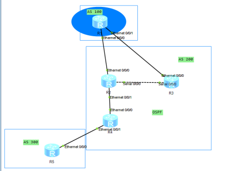
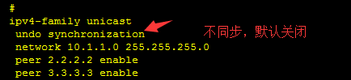

# BGP详解

## 2020.06.08

## BGP：

BGP是建立在TCP之上的 端口号为179

AS：（两者是区分开来的）特指被相关机构管理 运行相同路由协议的一组路由器（中国人只能和中国人说，外国人和外国人说）

BGP是运用在AS之间的

BGP的前身是EGP，EGP只能在AS之间简单的传递路由信息，不会对路由进行任何优选，也没有考虑如何在AS之间避免路由环路等问题，BGP一般运营在运营商的核心网

BGP的邻居发现：

先启动BGP的一端先发起TCP连接，如图所示，RTB先启动BGP协议，RTB使用随机端口号向RTA的179端口发起TCP连接。

路由器是通过物理口去建立邻居的；Loopback也能建立，前提是必须要有路由，需要建立一个动态路由或者静态路由。

源是12.1.1.1 目的2.2.2.2

源是2.2.2.2 目的 10.1.1.1

没有匹配，即三次握手没有成功

 

 

 

## AS号的分类：

1-64511 由IANA统一分配

64512-65535 私有企业或者自行分配

特点：BGP可以跨越多跳路由器建立邻居关系，非常吊

 

## 邻居关系：

EBGP（外部网关边界协议）：运行在不同AS之间的BGP路由器建立的邻居关系，默认的优先级是225，默认的TTL是1

IBGP（内部BGP协议）：运行在相同AS之间BGP路由器建立的邻居关系，默认的优先级是225，默认的TTL是255

[R1]router id 1.1.1.1  （标识路由器）

[R1]bgp 100 （配置邻居关系）

[R1-bgp]peer 2.2.2.2 as-number 100 （peer后面是对端邻居的接口地址，as-number后面是邻居路由器所在的AS号，AS号相同，就是IBGP邻居关系，AS号不同，就是EBGP邻居关系）

PS：建立IBGP邻居关系是时，一般使用loopback接口的IP地址，因为loopback接口开启后一直处于UP状态，只要保证路由可达，邻居关系就会处于稳定状态。而建立EBGP邻居关系时，一般使用直接接口的IP地址，因为EBGP是跨AS建立邻居关系，邻居关系建立之前非直连接口之间的路由不可达

BGP邻居关系配置的优化

在路由器上敲

[R1]router id 1.1.1.1  （标识路由器）

[R1]bgp 100 （配置邻居关系）

[R1-bgp]peer 2.2.2.2 as-number 100

[R1-bgp]peer 2.2.2.2 connect-interface LoopBack 0 （修改更新源，路由器默认是物理口建立可连接）

 

## 报文：

Open keeplive update route-refresh notification

open：邻居建立发送的第一个报文 协商参数

keeplive：周期性发送，去看链路是否正常

update：去更新路由信息

①更新路由属性相同的多个路由条目

②更新路由不可达的路由条目（删除）

route-refresh：当路由策略改变的时候会发送该报文去请求新的路由条目

notification：当邻居失效就会发送这个报文

一：Idle：BGP的初始状态，不会去接受任何邻居发来的任何请求

二：connect：如果成功了就进入OPEN SENT状态，如果失败了会根据重传计时器重新发起链接，同时切换到Active状态。也就是说，只要在Connect状态，就证明BGP正在试图建立连接，而不是等候。

①连接成功

②连接不成功

③请求超时

三：active：请求连接，向邻居去请求连接的，在OPENSENT的时候，如果BGP链接忽然丢失，也会进入这个状态。

第一种 请求成功 connect

第二种 请求不成功

第三种 请求超时

四：opensent

对收来的open报文进行检查，如果有错误，系统就会发送一条出错通知消息并退回到Idle状态，如果没有错误，BGP就开始发送Keepalive 报文，并复位Keepalive 计时器，开始计时。协商成功 进入下一个状态

五：opencomfirm：如果收到了一个Keepalive 报文，就转入Established 阶段，BGP邻居关系就建立起来了。如果TCP连接中断，就退回到Idle 状态。

六：establish：BGP 邻居关系已经建立，这时，BGP将和它的邻居们交换Update 报文

TTL：经过一台路由器，并且经过解封装和重新封装以后的源地址和目标地址不变，这时候，TTL减1

 

## 通告原则：

BGP通告原则之一：仅将自己最优的路由发给邻居

将10.1.1.0/24这个路由发布给邻居

 

下一跳自我：

看上图可知，10.1.1.0/24的下一跳是1.1.1.1，他就会把1.1.1.1发送给邻居，其他路由器也就接受到了这个1.1.1.1，但是，这些路由器并不能直接通信，因为下一跳是直接到达1.1.1.1了，所以，不是最优的路由，没有到达直连的那个路由器，所以，需要修改下一跳，把下一跳设置为从传到他的那个路由

如上图所示，它的下一跳就改变了，他就能把这个最优路由发布给其他的邻居，其他的路由器通过这个直连的下一跳，也就能通信了。

配置命令：[R2-bgp]peer 4.4.4.4 next-hop-local

BGP通告原则之二：通过EBGP获得的最优路由发布给所有BGP邻居

BGP通告原则之三：从IBGP学到的最优路由不会发给其他的IBGP邻居、（也是IBGP的水平分割）

R3从R1通过EBGP学来的10.1.1.0/24的路由发送给R2，但是R2不会通过IBGP把10.1.1.0/24学来的路由发送给R4，所以，R4是不会接收到10.1.1.0/24这条路由的

BGP通告原则之四：BGP与IGP的同步

也就是把BGP的路由表和IGP的路由表同步

华为默认关闭

IBGP水平分割：从IBGP学到的最优路由不会发给其他的IBGP邻居、

 

## 路由黑洞

解决：

1.全互联（TCP会话过多，资源占用就大了）

2.路由的引入，把BGP的路由引入到IGP中

前两个不是太靠谱，因为BGP有上万个路由条目，IGP只有几千个

3.MPLS

BGP路由信息处理

当从BGP邻居接收到Update报文时，路由器将会执行路径选择算法，来为每一条前缀确定最佳路径

得出的最佳路径被存储到本地BGP路由表（local_RIB）中，然后被提交给本地IP路由表

BGP的属性

公认：在Update报文当中，可以支持和识别的属性

①公认必遵：在Update报文当中，必须携带的属性

②公认任意：可以不携带在update报文当中

可选：在update报文当中，可以不识别的属性

可选过渡：本BGP路由器不识别的属性，但是可以把该属性传递给邻居

可选非过渡：本BGP路由器忽略的属性，并且不传递给邻居

BGP属性-Origin

Origin属性定义路径信息的来源，标记一条路由是怎么成为BGP路由的

orgin的三种属性：

i表明BGP路由通过network命令注入

e表明BGP路由是从EGP学来的（现在EGP不用了，但是可以通过路由的策略修改为e）

？即incomplete（路由引入）表明BGP路由通过其他方式学来的路由信息

三种Origin属性的优先级为：i>e>Incomplete(?)

通过EGP学习来的  E

incomplete（路由引入）

AS-PATH：记录了路由经过的所有AS的编号

规定AS_PATH越短（记录的AS编号越少），路径越优

BGP属性-Next_hop

1.EBGP邻居之间采用直连接口建立邻居关系，EBGP邻居在相互通告路由时会修改Next-hop为自己的出接口IP；

2.IBGP邻居通常采用Loopback接口建立邻居，当路由时本路由器起源的，在发送给邻居之后Next-hop该为自己的更新源地址，这样即使网络中出现链路故障，只要Next-hop可达，同样可以访问目的网段，提高网络稳定性

MED（以小为优）

仅在相邻的两个AS之间传递，收到此属性的AS不会再通告给任何第三方AS，用于判断流量进入AS时的最佳路由  和Local_Preference一样，也是设置怎么走

Local_Preference（以大为优）

Local_Preference属性仅在IBGP邻居之间有效，不通告给其他的AS。它表明路由器的BGP优先级，用于判断流量离开AS时的最佳路由 设置怎么走，往哪里走，控制往哪里走，默认是100

 

## BGP路由优选原则

BGP路由器将路由通告给邻居后，每个BGP邻居都会进行路由选择，路由选择有三种情况

1.该路由到达目的地唯一的路由，直接优选

2，对到达同一目的地的路由多条路由，优选优先级最高的

3.对到达同一目的地具有相同优先级的多条路由，必须用更细的原则去选择一条最优的

一般来说，BGP计算路由优先级的规则如下

1.丢弃下一跳不可达的路由

2.优选Preference_Value值最高的路由（私有属性，进本地有效）

3.优选本地优先级最高的路由

4.优选手动聚合>自动聚合>network>import>从对等体学到的

5.优选AS_Path最短的路由

6.起源类型IGP>EGP>Incomplete

7.对于来自同一AS的路由，优选MED值最小

8.优选从EBGP学来的路由（EBGP>IBGP）

9.优选AS内部IGP的Metric最小的路由

如果前九条都是一样的话，就会出现负载分担

 

但是，BGP不会让他出现负载分担的

10.优选Cluster_List最短的路由

11.优选Orginator_ID最小的路由

12.优选Router_ID最小的路由器发布的路由

13.优选具有较小的IP地址的邻居学来的路由

 

Preference_Value是BGP的私有属性（华为的私有属性），Preference_Value相当于BGP选路规则的Weight值，仅在本地路由器生效，Preference_Value值越大，越优先

 

### 引入默认路由

第一种方式

[R1]bgp 100

[R1-bgp]peer 2.2.2.2 default-route-advertise

第二种方式

[R1]ip route-static 0.0.0.0 0.0.0.0 NULL 0（目的是让默认路由出现在igp路由表里）

[R1-bgp]network 0.0.0.0 0

 

### 手工汇总：

第一种：

[R1]ip route-static 123.0.0.0 8 NULL 0

[R1-bgp]network 123.0.0.0 8

第二种：

aggregate 123.0.0.0 8

收到的是明细路由和汇总路由

 

### 路由反射器（RR）

1.客户机

2.服务器

3.非客户机

相当于一面镜子，通过这面镜子进行反射

[R2-bgp]peer 3.3.3.3 reflect-client

怎么改最优

①从EBGP学来的路由会发给所有的客户机和非客户机

②从非客户机学来的路由会发给所有的客户机

③从客户机学来的路由会发给除了该客户机以外的所有客户机和非客户机