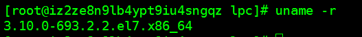
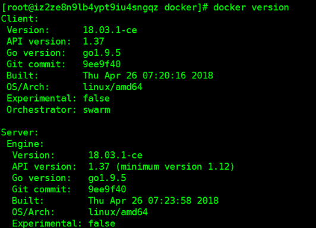
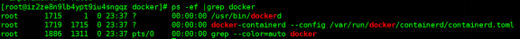

# CentOS7下docker安装及镜像位置修改方法

## 1，docker安装

1.1，查看系统内核版本是否大于等于3.10，低于此版本不可安装。

`uname -a`

1.2，安装依赖包，并增加docker的源

`yum install yum-utils device-mapper-persistent-data lvm2 -y`

`yum-config-manager --add-repo https://download.docker.com/linux/centos/docker-ce.repo`

1.3，安装docker

`yum install docker-ce -y`

## 2，修改docker文件路径

2.1，安装docker后不要启动，这里修改docker的运行路径，默认位置是`/var/lib/docker`

在目标位置创建目录`/data/docker`，并将其链接到默认路径下。似乎只能使用这种方法，其它各种修改配置文件的方法均无效。

`ln -s /data/docker/ /var/lib/docker`

## 3，配置开机启动项

3.1，启动docker并设置开机启动项。

`systemctl start docker.service`

`systemctl enable docker`

## 4，查看docker配置

4.1，`docker version`查看版本信息

4.2，查看docker进程信息，安装完毕。

