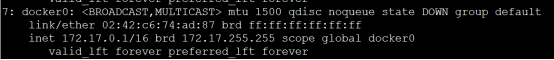
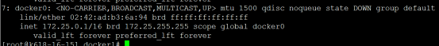

# docker修改ip段

## 2020.07.15

docker默认ip段是172.17.0.0/16，需要ip段改为172.25.0.0/16。下面是docker0的ip情况：

操作方法：

1，确认没有容器正在运行，如有，停之。

2，修改`/etc/docker/daemon.json`文件，写入新网段信息。注意，这里的bip指的是docker0网桥的IP地址，不是网段信息。默认情况下没有这个文件，需创建。

`{`

  `"bip": "172.25.0.1/16"`

`}`

3，重启docker，重启后即使用新ip通信。

`systemctl stop docker`

`ip link set dev docker0 down`

`brctl delbr docker0`

`systemctl start docker`

